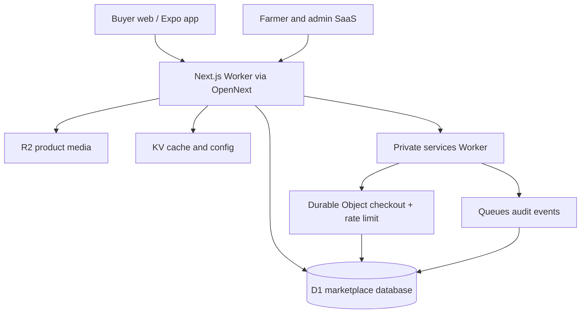

# Hariyo Mart Nepal v6.1 — Advanced Cloudflare Marketplace SaaS

Hariyo Mart is a production-oriented marketplace connecting buyers with farmers, cooperatives and produce sellers across Nepal. The web SaaS, marketplace API, data, live inventory coordination, media and background events now run on Cloudflare. The Expo app uses the same API.

## Working product surface

- 84 Nepal-focused starter products across all seven provinces
- Premium square-card Next.js 16 storefront with persistent location, radius, district, organic,
  stock and distance-aware discovery controls
- Guest cash-on-delivery orders with idempotency and phone-based tracking
- Buyer accounts, rotating sessions, addresses, wishlist, rewards and order history
- Farmer onboarding, tenant workspace, R2 harvest photos, inventory and fulfillment tools
- Admin verification, listing moderation, orders, settlement views and audit history
- D1 content publishing, service zones, promotions, review moderation, support desk, inventory
  event history, newsletter subscribers, notifications and platform settings
- Hariyo Journal with eight useful buyer, farmer and regional food stories
- Expo Router app with SecureStore auth, location discovery and shared marketplace checkout
- Online payment providers safely disabled until merchant onboarding and webhook certification

## Cloudflare architecture



`apps/web` is the public Worker and same-origin API. `infra/cloudflare/services` is a private Worker that serializes checkout and rate limiting through Durable Objects and consumes Queue events. `apps/mobile` is the Expo app. `apps/api` remains a legacy Node adapter for export/self-hosting compatibility; Cloudflare production does not use it.

## Local Cloudflare development

Requirements: Node.js 22.13+ and npm.

```bash
npm ci
cp apps/web/.dev.vars.example apps/web/.dev.vars
# Replace all example secrets in apps/web/.dev.vars
npm run cloudflare:db:local
npm run dev
```

The web app and API run at `http://localhost:3000` and `http://localhost:3000/api`. Wrangler provides local D1, R2, KV, Queue and service bindings. Remove `apps/web/.dev.vars` before sharing the directory; it is already ignored by git.

## Quality gate

```bash
npm run release:check
```

The gate runs formatting, lint, all TypeScript projects, tests, security/content checks, dependency audit, Next.js/legacy/mobile builds, and the OpenNext Cloudflare build.

## Production

Provision the Cloudflare resources once, add Worker secrets, apply D1 migrations and deploy the private services Worker before the web Worker. Exact commands and GitHub Actions configuration are in [`docs/CLOUDFLARE_PRODUCTION_V6.md`](docs/CLOUDFLARE_PRODUCTION_V6.md).

For this provisioned release, authenticate Wrangler on a machine that permits Worker uploads and run:

```bash
npm run finish:cloudflare
```

The command is resumable, applies all pending D1 migrations (including the v6.1 operations schema)
and will not rotate production secrets that already exist.

Real secrets, payment keys and merchant credentials are never stored in this repository. Cloudflare
resource IDs are non-secret deployment identifiers; regenerate the config before targeting another
account.
